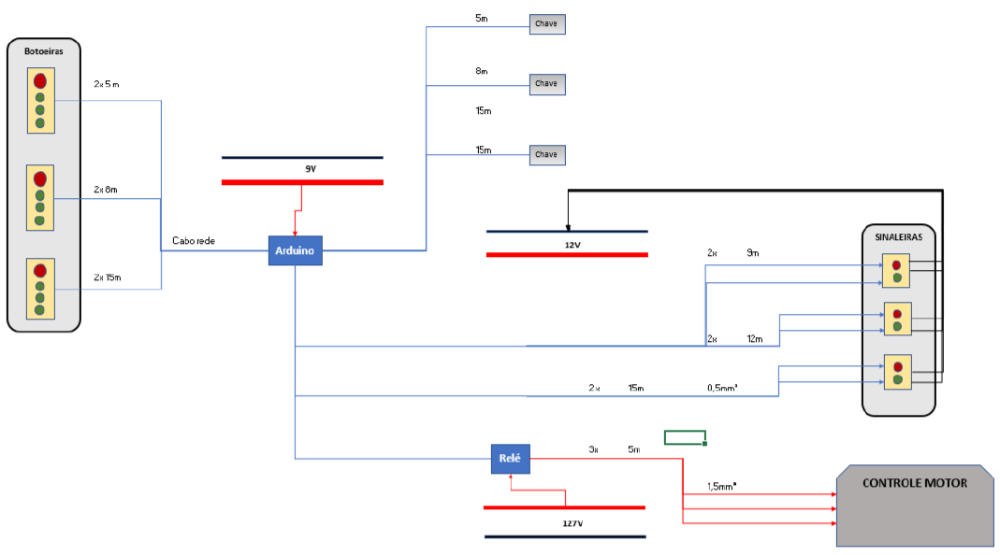
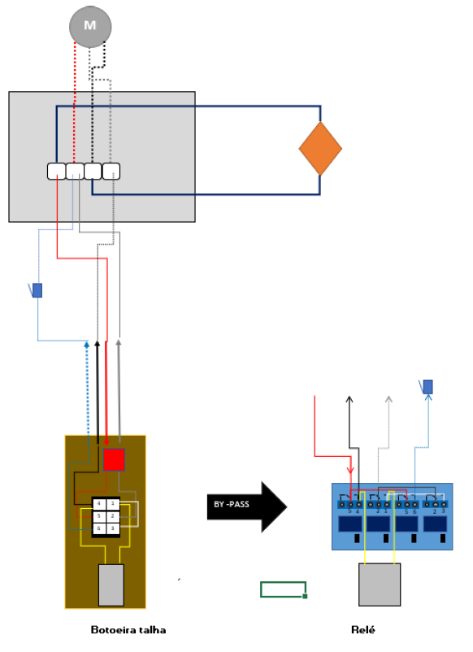
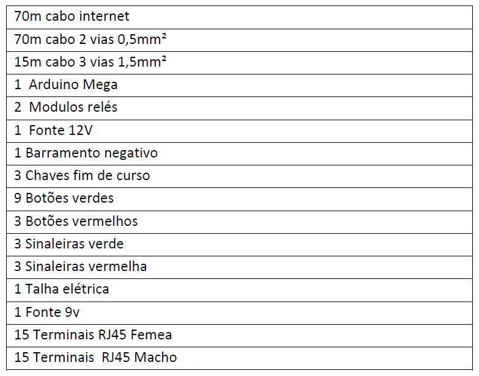
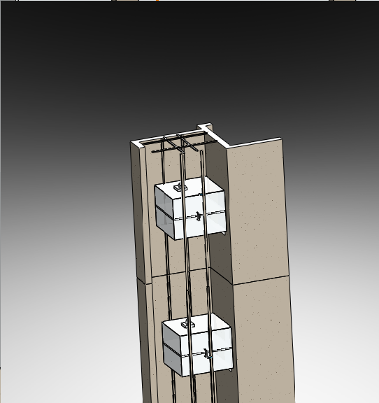
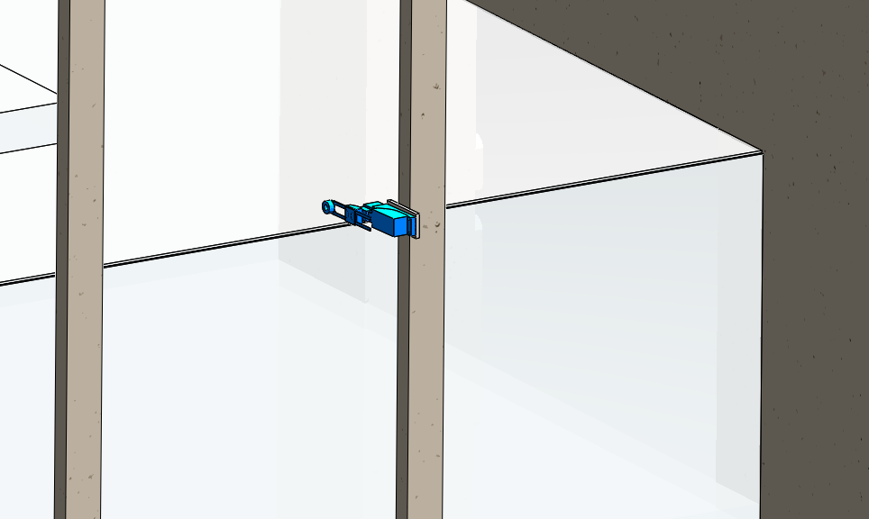

# Projeto de Automação Elevador Alimentício

#### 1. INFORMAÇÕES GERAIS

Neste repositório estão presentes dado e metodologias utilizadas para a implementação do circuito de controle de um elevador alimentício.

#### 2. OBJETIVO DO PROJETO

O projeto tem como objetivo implementar a parte elétrica de um elevador de carga de dois andares.

#### 3. FINALIDADE DO PROCESSO

A solução proposta tem como objetivo facilitar a logística de movimentação de produtos logísticos num restaurante.
Será desenvolvido e implementado o projeto elétrico de um elevador de carga de dois andares, visando soluções mais eficiente, seguras e de baixo custo.

#### 4. DESCRIÇÃO DO SISTEMA

O processo consiste no desenvolvimento do processo de automação que será responsável por movimentar o elevador. O sistema apresenta o térreo e mais dois andares, onde cada andar apresentará um painel com um botão de chamada de elevador e mais dois botões para escolha do andar destino. Além disso, cada painel apresentará uma chave de segurança para parada imediata do elevador. Na estrutura metálica responsável por alinhar a cabine, serão anexadas chaves fim de curso (em cada andar) para detecção do elevador. Para içar a cabine, uma talha elétrica será fixada na estrutura metálica presente na parte superior do poço do elevador e será implementado um by-pass no seu circuito de funcionamento para integração com o circuito do elevador. Para controlar o sistema, é escolhido a plataforma de prototipagem Arduino Mega.

#### 5. DIAGRAMAS

Nos itens a seguir serão mostrados os diagramas que compõe o projeto elétrico e de comando do elevador

##### 5.1 FLUXOGRAMA LÓGICO

Na figura abaixo é proposto a lógica de funcionamento do Elevador Alimentício.

##### 5.2 ESQUEMA CIRCUITO DE COMANDO
No diagrama abaixo é possível observar a conexão dos dispositivos que estão presentes na malha de automação do sistema do elevador.

##### 5.3 ADAPTAÇÃO RELÉ
Para adaptar a talha elétrica ao projeto do Elevador Alimentício foi necessário criar um circuito análogo ao circuito presente na botoeira da talha. Esse circuito foi implementado com um relé que é controlado por um Arduino Mega.

#### 6. LISTA DE EQUIPAMENTOS E INSTRUMENTOS

#### 7. MODELAGEM SOLIDWORKS
<i>Vista Isométrica traseira do elevador<i>
  

***
<i>Localização da chave fim de curso no primeiro andar<i>
  

***
<i>Localização da chave fim de curso no segundo andar<i>
  

***
#### 8. PROGRAMAÇÃO

A [programação](/codigo_elevador.ino) foi desenvolvida na linguagem C++ para ser implementada num Arduino Mega
